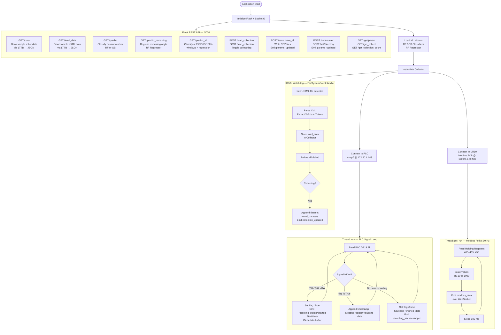
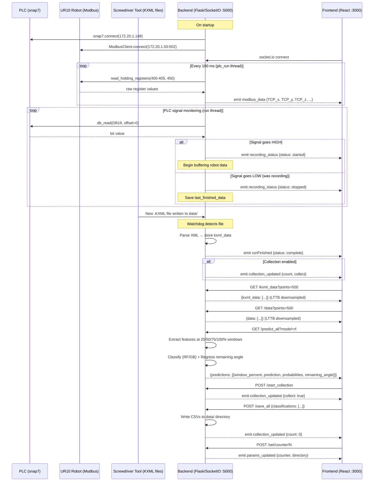

# System Flowcharts

## 1. Backend Flowchart

---

## 2. Frontend Flowchart

```mermaid
flowchart TD
    APP([App Mount]) --> SOCKET[Establish Socket.IO\nto localhost:5000]
    APP --> RM[RobotMonitor]
    APP --> CC[ColectorCard]
    APP --> PC[PredictorCard]
    APP --> SC[ScrewCard]
    APP --> KP[KXMLPlotter]
    APP --> RP[RobotPlotter]

    subgraph RM[RobotMonitor]
        direction TB
        RM1[Subscribe socket: modbus_data] --> RM2[Update live TCP\nx/y/z/rx/ry/rz\nRobot_I display]
        RM3[Subscribe socket: connect/disconnect] --> RM4[Show Active / Offline badge]
    end

    subgraph CC[ColectorCard]
        direction TB
        CC1[Mount: fetch /get/param\n/get_collect\n/get_collection_count] --> CC2[Show counter\ndirectory\ncollection count]
        CC3[Subscribe socket:\nparams_updated\ncollection_updated] --> CC2
        CC4[Toggle Switch] -- POST --> CC5["/start_collection<br/>or /stop_collection"]
        CC6[Counter input blur/Enter] -- POST --> CC7["/set/counter/N"]
        CC8[Directory input blur/Enter] -- POST --> CC9["/set/directory/path"]
        CC10[Save All button] -- POST /save_all\nwith classifications --> CC11[Clear buffer]
    end

    subgraph PC[PredictorCard]
        direction TB
        PC1[Subscribe socket: runFinished] --> PC2[GET /predict_all?model=rf/gb]
        PC3[Run Prediction button] --> PC2
        PC2 --> PC4[Render table:\nwindow% / label / conf / remaining angle]
    end

    subgraph SC[ScrewCard]
        direction TB
        SC1[Mount + socket: runFinished] --> SC2[GET /predict_all?model=rf]
        SC2 --> SC3[Take last 100% window prediction]
        SC3 --> SC4[Compute percentIn\nfrom remaining_angle]
        SC4 --> SC5[Animate screw\ndepth into wood block]
        SC3 --> SC6[Display Predicted State badge]
    end

    subgraph KP[KXMLPlotter]
        direction TB
        KP1[Mount + socket: runFinished] --> KP2[GET /kxml_data?points=500]
        KP2 --> KP3[Plot Torque / Speed\nCurrent / Depth / Angle\nvs Time]
    end

    subgraph RP[RobotPlotter]
        direction TB
        RP1[Mount + socket: runFinished] --> RP2[GET /data?points=500]
        RP2 --> RP3[Plot TCP x/y/z\nrx/ry/rz + Robot_I\nvs Time]
    end
```

---

## 3. Interface Flow (REST API + WebSocket)

---

## 4. Functional System Decomposition — Simple (Gomaa Chart)

```mermaid
flowchart TD
    SYS["<b>Screw Quality Monitoring System</b>"]

    SYS --> ACQSYS[1. Data Acquisition]
    SYS --> PROCSYS[2. Data Processing]
    SYS --> MLINFSYS[3. ML Inference]
    SYS --> STORESYS[4. Data Storage]
    SYS --> VISSYS[5. Visualisation &amp; UI]

    ACQSYS --> ACQ1[PLC Interface]
    ACQSYS --> ACQ2[Robot Interface]
    ACQSYS --> ACQ3[KXML File Watcher]

    PROCSYS --> PROC1[Unit Scaling]
    PROCSYS --> PROC2[LTTB Downsampling]
    PROCSYS --> PROC3[Feature Extraction]
    PROCSYS --> PROC4[Windowing]

    MLINFSYS --> ML1[Classification\nRF / GB]
    MLINFSYS --> ML2[Regression\nRemaining Angle]

    STORESYS --> STORE1[In-memory Buffer]
    STORESYS --> STORE2[Collected Datasets]
    STORESYS --> STORE3[CSV Export]

    VISSYS --> UI1[Robot Monitor]
    VISSYS --> UI2[Collector Control]
    VISSYS --> UI3[ML Predictor Panel]
    VISSYS --> UI4[Screw Animation]
    VISSYS --> UI5[KXML Plotter]
    VISSYS --> UI6[Robot Plotter]
```

---

## 5. Functional System Decomposition — Detailed (Gomaa Chart)

```mermaid
flowchart TD
    SYS["<b>Screw Quality Monitoring System</b>"]

    SYS --> ACQSYS[1. Data Acquisition System]
    SYS --> PROCSYS[2. Data Processing System]
    SYS --> MLINFSYS[3. ML Inference System]
    SYS --> STORESYS[4. Data Storage System]
    SYS --> VISSYS[5. Visualisation &amp; UI System]

    %% 1. Data Acquisition
    ACQSYS --> ACQ1[1.1 PLC Interface\nsnap7 S7 client\nMonitor DB19 bit]
    ACQSYS --> ACQ2[1.2 Robot Interface\nModbus TCP\nUR10 registers 400-450]
    ACQSYS --> ACQ3[1.3 KXML File Watcher\nWatchdog observer\ndata/ directory]

    ACQ1 --> ACQ1A[1.1.1 Detect screw-run start/stop]
    ACQ2 --> ACQ2A[1.2.1 Poll TCP position x/y/z]
    ACQ2 --> ACQ2B[1.2.2 Poll TCP orientation rx/ry/rz]
    ACQ2 --> ACQ2C[1.2.3 Poll robot current]
    ACQ3 --> ACQ3A[1.3.1 Parse X-Axis time values]
    ACQ3 --> ACQ3B[1.3.2 Parse Y-Axes\nTorque/Speed/Current/Depth/Angle]

    %% 2. Data Processing
    PROCSYS --> PROC1[2.1 Unit Scaling\nRegisters → engineering units]
    PROCSYS --> PROC2[2.2 LTTB Downsampling\nReduce to ≤500 points]
    PROCSYS --> PROC3[2.3 Feature Extraction\nStatistical features per window\nmean/std/max/min/last/median/slope]
    PROCSYS --> PROC4[2.4 Windowing\nExpanding windows at\n25% / 50% / 75% / 100%]

    %% 3. ML Inference
    MLINFSYS --> ML1[3.1 Classification\nRandom Forest or Gradient Boosting\nClasses: N / OT / UT / M / PA]
    MLINFSYS --> ML2[3.2 Regression\nRandom Forest Regressor\nPredicts remaining tightening angle]
    MLINFSYS --> ML3[3.3 Model Loading\njoblib .joblib files\npredictors_ml + regressors_ml]

    ML1 --> ML1A[3.1.1 Scale features via StandardScaler]
    ML1 --> ML1B[3.1.2 Return label + class probabilities]
    ML2 --> ML2A[3.2.1 Scale features via StandardScaler]
    ML2 --> ML2B[3.2.2 Return remaining_angle float]

    %% 4. Data Storage
    STORESYS --> STORE1[4.1 In-memory ring buffer\nCurrent run robot data]
    STORESYS --> STORE2[4.2 Collected dataset buffer\nold_datasets list\nkxml + modbus pairs]
    STORESYS --> STORE3[4.3 CSV Export\nRobot data CSV\nKXML data CSV]

    STORE3 --> STORE3A[4.3.1 Filename:\ndata_DDMMYYYY_counter_class_robot.csv]
    STORE3 --> STORE3B[4.3.2 Filename:\ndata_DDMMYYYY_counter_class_kxml.csv]

    %% 5. Visualisation & UI
    VISSYS --> UI1[5.1 Robot Monitor\nLive TCP + current values\nvia WebSocket]
    VISSYS --> UI2[5.2 Collector Control\nToggle collection\nSet counter / directory\nBulk classify & save]
    VISSYS --> UI3[5.3 ML Predictor Panel\nWindow-by-window results\nwith confidence scores]
    VISSYS --> UI4[5.4 Screw Animation\nVisual depth indicator\nbased on remaining angle]
    VISSYS --> UI5[5.5 KXML Plotter\nTorque / Speed / Current\nDepth / Angle vs Time]
    VISSYS --> UI6[5.6 Robot Plotter\nTCP x/y/z/rx/ry/rz\nRobot current vs Time]
    VISSYS --> UI7[5.7 Communication Layer\nREST HTTP fetch\nSocket.IO WebSocket]

    UI7 --> UI7A[5.7.1 REST: data / kxml_data\npredict_all / collection control]
    UI7 --> UI7B[5.7.2 WebSocket events:\nmodbus_data / runFinished\nrecording_status / params_updated\ncollection_updated]
```

