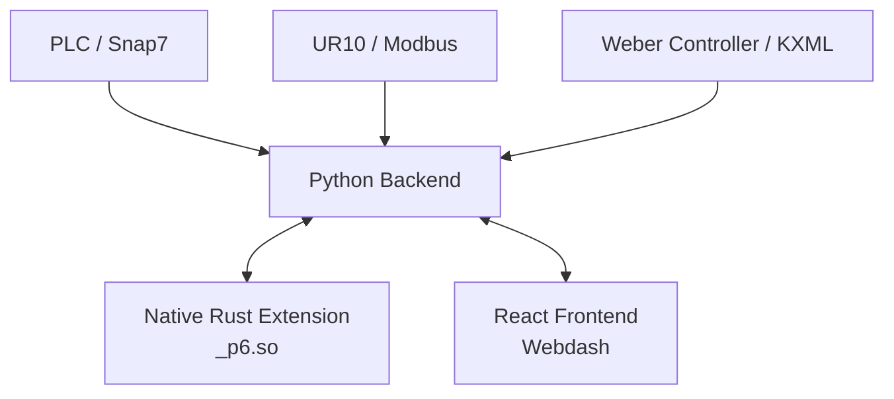

# p6: Screw Quality Monitoring System


## Bachelor Project at Aalborg University (AAU)

This repository contains the source code for a Bachelor project developed by a student group at **Aalborg University (AAU)**. The project focuses on real-time quality monitoring and predictive analysis of industrial screwing processes using Machine Learning.

---

## Project Overview

The **p6** system is designed to monitor a robotic screwing cell in real-time. It integrates data from multiple sources:
- **UR10 Robot**: Motion and current data via Modbus TCP.
- **Weber Screwdriver (C30S Controller)**: Torque, depth, and speed data via KXML files.
- **PLC**: Synchronization signals via Snap7.

The system performs real-time classification of screwing runs (e.g., Normal, Over-tightened, Under-tightened) and predicts the remaining tightening angle using Random Forest and Gradient Boosting models.

### Key Features
- **Real-time Monitoring**: Live WebSocket-based dashboard for robot and screwdriver state.
- **Hybrid Architecture**: High-performance Rust core for data processing (LTTB downsampling) with a flexible Python Flask/SocketIO backend.
- **ML-Powered Diagnostics**: Instant classification of screwing quality at various stages (25%, 50%, 75%, 100% of the run).
- **Interactive Dashboard**: Modern React-based frontend with live plotting and 3D-visualisation hints.
- **Automated Data Collection**: Watchdog-based file tracking for seamless integration with industrial equipment.

---

## Architecture



### Tech Stack
- **Backend**: Python 3.13, Flask, SocketIO, `uv` for environment management.
- **Native Core**: Rust 2024, `PyO3`, `maturin`, `ndarray` (LTTB downsampling).
- **Frontend**: React, TypeScript, Rsbuild, SCSS.
- **ML**: Scikit-Learn (Random Forest, Gradient Boosting), Joblib.

---

## Getting Started

### Prerequisites
- **Python 3.13+** (recommended via `uv`)
- **Rust**
- **Node.js & Yarn**

### Installation

1. **Clone the repository**:
   ```bash
   git clone <repo-url>
   cd p6
   ```

2. **Setup the Backend**:
   Using `uv`, all dependencies and the Rust extension are handled automatically:
   ```bash
   uv sync
   ```

3. **Setup the Frontend**:
   ```bash
   cd webdash
   yarn install
   ```

### Running the System

1. **Start the Backend**:
   ```bash
   uv run p6
   ```
   *Note: This starts the Flask server on port 5000 and the socket server.*

2. **Start the Frontend**:
   ```bash
   cd webdash
   yarn dev
   ```
   *The dashboard will be available at `http://localhost:3000`.*

---

## Operational Details

### Data Labels & Error Types
The system uses the following labels for screwing quality classification:
- **N (Normal)**: Properly tightened screw.
- **UT (Under)**: Under-tightened (e.g., insufficient torque).
- **OT (Over)**: Over-tightened (e.g., excessive torque).
- **M (Missing)**: Missing screw.

### Hardware Integration
- **PLC**: DB19 bit monitoring for start/stop synchronization.
- **UR10**: Modbus TCP registers 400-450 (TCP position, orientation, and current).
- **Weber C30S**: Serial/USB connection for KXML data export.

---

## Project Layout

- `python/p6/`: Core Python logic, ML model management, and API routes.
- `src/`: High-performance Rust implementations for data downsampling and feature extraction.
- `webdash/`: React frontend application.
- `scripts/`: Utility scripts for data collection and misclassification analysis.

---

## License

This project is licensed under the **GNU GPLv3**. See the [LICENSE](LICENSE) file for details.
